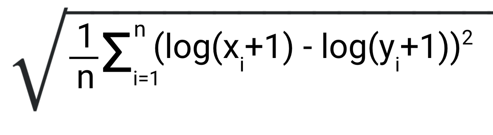

# geopandas
A hackathon to learn how to use geo pandas and based on kaggle competition data found in https://www.kaggle.com/c/nyc-taxi-trip-duration

# Getting Started
Have a look at the notebook geopandas_taxi.ipynb to get started with the task and installing dependencies

# Goal
Create a function that - given two coordinates inside Manhattan - gives an estimate of a taxi journey time in seconds:

```
def function(coord1=(lat, lng), coord2=(lat, lng)):
    ...
    ...
    ...
    return est_journey_time
```

This function is better when it acheives a lower mean_squared_log_error using the evaluation set.



# Background

## Geoindexing

* Imagine you have 1000 points in a 2 dimentional space (latitude, longitude). Lets call these points "data"
* And you are given an extra point. Lets call this point "origin"
* Your task is to find the point from data closest to origin. How would you do this?

## The bad way

* You would calculate the euclidian distiance to every point in data and origin and choose the minimum
* Takes too long. This takes linear time for a search operation relative to number of points in data
* O(n)

## The good way

* Use a spacial index
* Takes logarithmic time
* O(log(n))

## KD Trees

* Space partitioning data structure based on n dimentions (in our case 2)


